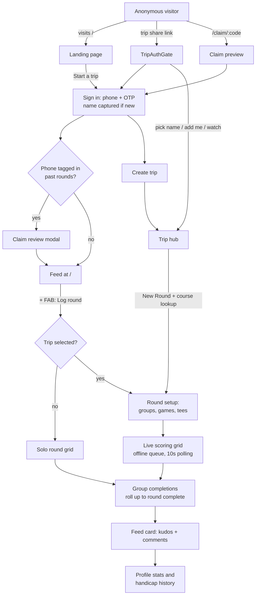

# User Journeys

A map of every user-facing journey in Golf Trip Live Scorecard — how a user gets in, forms a trip, starts and scores a round, and loops back through the social layer. Each section lists the entry points, the step-by-step flow, the key branches, and the code that implements it.

Frontend routes live in [App.tsx](../artifacts/golf-scorecard/src/App.tsx); all API paths below are prefixed with `/api` and served from [artifacts/api-server/src/routes](../artifacts/api-server/src/routes/).

## Roles

A person interacts with the app in one of these modes, and most journeys branch on them:

| Role | How it happens | What they can do |
|---|---|---|
| **Anonymous visitor** | No session in `localStorage` | Browse landing page, open trip/round links read-only, preview claim links |
| **Signed-in user** | Phone + OTP verified, 30-day JWT in `auth:session` | Feed, profile, My Golf, create trips/rounds, follow, kudos, comment |
| **Trip player** | A `players` row in a trip linked via `players.user_id`, selected per-trip in `auth:trip:{tripId}` | Enter scores, edit round setup, complete groups |
| **Observer** | Chose "just watching" (or auto-set on a scorecard deep-link) | Read-only view of a trip and its rounds |
| **Placeholder player** | A roster row with no `user_id`, optionally tagged with `invited_phone` / `claim_code` | Scores are kept for them until a real user claims the row |

## Journey overview

## 1. Sign up / sign in (phone + OTP)

There is no separate registration. Sign-up and sign-in are the same two-step modal ([sign-in-modal.tsx](../artifacts/golf-scorecard/src/components/sign-in-modal.tsx)), opened from the nav bar, the landing page, or any gated action (`RequireSignIn`, `TripAuthGate`, claim landing, trip creation, profile, My Golf, solo rounds).

1. **Phone step.** The number is normalized to E.164 (US 10-digit gets `+1`). `POST /auth/request-otp` sends a 6-digit code via Twilio Verify — rate-limited per phone to 1/30s and 5/15min — and returns `isNewUser`.
2. **Code step.** Six-digit input with a 30-second resend cooldown. If the phone is new, the same screen also collects **full name (required)** and **GHIN number (optional)**. `POST /auth/verify-otp` does find-or-create by phone, so the account is created at verify time; returning users just get `lastLoginAt` bumped.
3. A 30-day JWT lands in `localStorage` under `auth:session` ([auth.ts](../artifacts/golf-scorecard/src/lib/auth.ts)). It auto-refreshes when under 7 days from expiry (`POST /auth/refresh`), and any API 401 clears the session.

**Immediately after sign-in** the global [ClaimReviewModal](../artifacts/golf-scorecard/src/components/claim-review-modal.tsx) calls `GET /users/me/claimable`. If anyone previously tagged this phone on a placeholder roster row, the user sees "You were tagged in N rounds" and can claim or decline them all — this is how scores entered before they joined attach to the new account (see journey 8).

There is no global post-login redirect; each entry point decides (the landing page goes to trips, the claim page auto-claims, gates simply re-render).

**Backend:** [auth.ts](../artifacts/api-server/src/routes/auth.ts), [twilio.ts](../artifacts/api-server/src/lib/twilio.ts), [jwt.ts](../artifacts/api-server/src/lib/jwt.ts).

## 2. Anonymous visitor → landing

`/` renders the marketing landing page ([landing.tsx](../artifacts/golf-scorecard/src/pages/landing.tsx)) when signed out: a hero with a faux live scorecard, feature sections, and the primary CTA **"Start a trip"** → `/trips/new` (which gates on sign-in). A signed-in user visiting `/landing` directly instead sees a "Welcome back" banner with a **Continue trip** shortcut to their most recent trip.

## 3. Creating a trip

**Entry points:** landing CTA, My Golf → Trips tab → "New trip", or `/trips/new` directly.

1. Sign-in gate if needed ("Sign in to create a trip"; dismissing navigates home).
2. **One field:** trip name, defaulting to today's date. No players or course here by design — "you'll add players inside."
3. `POST /trips` stamps the caller as `createdByUserId` and **auto-follows** the creator into trip follows, so the trip appears in My Golf immediately. The app then navigates to the trip hub.

**Code:** [trips-new.tsx](../artifacts/golf-scorecard/src/pages/trips-new.tsx), [trips.ts](../artifacts/api-server/src/routes/trips.ts).

## 4. Joining a trip — the identity gate

Trips are joined by **sharing a link** ([ShareTripModal](../artifacts/golf-scorecard/src/components/share-trip-modal.tsx): copy, SMS deep-link, native share). Every trip page is wrapped in [TripAuthGate](../artifacts/golf-scorecard/src/components/trip-auth-gate.tsx), which resolves "who am I in this trip" and stores the answer per-trip in `localStorage` (`auth:trip:{tripId}`, managed by [trip-identity.ts](../artifacts/golf-scorecard/src/lib/trip-identity.ts)).

The gate evaluates, in order:

1. **Identity already chosen** → pass through.
2. **Auto-resolve:** a signed-in user whose `userId` matches a roster row becomes that player, no picker.
3. **Auto-observer:** signed in, not on the roster, arriving on a scorecard deep-link → observer mode, so shared scorecard links open frictionlessly.
4. **Not signed in** → forced sign-in modal ("Sign in to join this trip").
5. **"Who are you?" picker:**
   - Pick your name from the roster. Choosing an unlinked row claims it to your account (server-guarded: only if the row is unclaimed and either untagged or tagged with *your* phone — see journey 8).
   - **"I'm not in the list — add me"**: inline form, name and handicap prefilled from your profile; the handicap you enter syncs back to your profile.
   - **"Just watching"**: bookmarks the trip (save/follow) and sets observer mode.

Observers see everything but every mutating affordance — New Round, Add Player, Setup tab, score cells — is hidden or inert. A "Signed in as … / switch" control in trip and round headers clears the per-trip identity.

## 5. Starting a new round

There are two creation surfaces:

**Inside a trip** — trip hub ([trip-hub.tsx](../artifacts/golf-scorecard/src/pages/trip-hub.tsx)) → Rounds tab → **New Round**:

1. **Course autocomplete** ([CourseSearchField](../artifacts/golf-scorecard/src/components/course-search-field.tsx)): debounced search (3+ chars) against the server-side GolfCourseAPI proxy ([courses.ts](../artifacts/api-server/src/routes/courses.ts)), which normalizes every course to length-18 `par`/`holeHcp` arrays and keeps the API key off the browser. Selecting a course auto-fills the round name, tee box, rating, slope, par, and stroke index; multi-tee courses offer a tee picker.
2. **Date** (defaults to today) and optional Advanced Options (name/course/tee overrides).
3. `POST /trips/:tripId/rounds` (caller must be a player, follower, or trip creator) → straight into the scoring page.

**From anywhere else** — the feed's **"+" FAB** or My Golf's **"Log round"** open [SoloRoundModal](../artifacts/golf-scorecard/src/components/solo-round-modal.tsx): course + an **optional trip picker**. It calls the unified `POST /rounds` ([rounds-me.ts](../artifacts/api-server/src/routes/rounds-me.ts)), where `tripId` is nullable — no trip means a **solo round**. The server find-or-creates the caller's player row in the right scope either way and returns `{tripId, roundId, playerId}`; the client routes to `/rounds/:roundId` (solo) or `/trips/:tripId/rounds/:roundId`.

**Round setup** (Setup tab of the round page, hidden from observers) configures play:

- **Groups editor**: drag-and-drop players into foursomes (4 slots per group; slots 1–2 form Team A, 3–4 Team B for Nassau and two-man scramble).
- **Per-player tee overrides**, chosen from the looked-up course's tees; each player's own par/rating/slope feeds their scoring.
- **Handicap mode**: net (group-relative — the lowest WHS course handicap in your group plays scratch) or gross.
- **Game toggles**: Stableford, Skins, Nassau, Net Stroke; a **scramble** toggle (two-man or four-man) replaces the individual games.
- Editable 18-row par / stroke-index table, and the **public/private visibility** toggle (server-enforced: only the trip creator may flip it) that gates feed and profile exposure.

## 6. Logging scores — the live scoring loop

The core screen is [round.tsx](../artifacts/golf-scorecard/src/pages/round.tsx), with **Scorecard | Results | Setup** tabs.

**Grid entry.** An 18-hole grid with players as columns (showing course and playing handicap). Tap a cell for an inline numeric input: single digits auto-commit after 500ms (leaving room for 10–19), 10+ commits immediately, Enter/Tab commits and advances. An entry-mode toggle chooses whether focus advances down your own column ("Just me") or across the whole group's row ("Whole group") — the shared-phone-in-the-cart mode. Players in a group can flip between "My group" and "All players" views. Cells color-code by **net** result vs par, handicap strokes show as asterisks, and a gross birdie fires confetti (reduced-motion aware).

**Offline-first, live everywhere.** Score writes go through a local queue ([offline-sync.ts](../artifacts/golf-scorecard/src/lib/offline-sync.ts)) that overlays pending values on the grid and replays on reconnect, with a sync-status pill in the header. Scores and leaderboards poll every 10 seconds, so every phone in the group converges on the same state.

**Results tab.** A single endpoint — `GET /trips/:tripId/rounds/:roundId/leaderboard` ([leaderboard.ts](../artifacts/api-server/src/routes/leaderboard.ts)) — returns all games at once, computed server-side in [scoring.ts](../artifacts/api-server/src/lib/scoring.ts) so every client agrees: per-player gross/net/Stableford/skins, per-hole Skins with carryovers, and team Nassau (front 9 / back 9 / total 18) per group. Scramble rounds swap in a team scorecard and team leaderboard. A "How scoring works" modal explains each format. The trip hub's Leaderboard tab aggregates the same numbers across all rounds.

**Finishing a round.** Rounds with groups complete **per group**: a sticky "Complete round for Group N" bar (with a blank-holes warning) lets each foursome close out independently, and the round's `completedAt` rolls up automatically once every group is complete — reopening any group reopens the round ([groups.ts](../artifacts/api-server/src/routes/groups.ts)). Groupless rounds use a manual "Mark round complete" in Setup. As a backstop, an hourly server sweep ([auto-close.ts](../artifacts/api-server/src/lib/auto-close.ts)) closes any past-dated round left open.

**Solo rounds** ([solo-round.tsx](../artifacts/golf-scorecard/src/pages/solo-round.tsx), sign-in required) are deliberately minimal: a flat 18-input grid for one player, a gross/net header, and a complete/in-progress toggle — no groups, games, tabs, or offline queue. To others, a solo round is visible only once it is both public **and** completed.

## 7. The social loop — feed, kudos, comments, follows

**Feed.** Signed-in users land on the feed at `/` ([feed.tsx](../artifacts/golf-scorecard/src/pages/feed.tsx) / [feed.ts](../artifacts/api-server/src/routes/feed.ts)): tabs **Buddies** (people you've shared a round with — becomes the default once you have any), **Mine**, and **All**, split into *Live rounds* and *Finished rounds*, refreshing every 30s with cursor pagination. Only `public` rounds appear; the All tab additionally requires at least one linked player with a public profile. Live cards show "thru N" progress and the current leader.

**Kudos and comments.** Feed cards carry a kudos heart and a comment count that deep-links into the round, where a social strip hosts kudos (with recent-user links) and one-level-threaded comments (1–1000 chars, author-deletable). Private rounds reject both ([round-kudos.ts](../artifacts/api-server/src/routes/round-kudos.ts), [round-comments.ts](../artifacts/api-server/src/routes/round-comments.ts)).

**Profiles.** `/profile` ([profile.tsx](../artifacts/golf-scorecard/src/pages/profile.tsx)) is your own: editable handicap index (changes are journaled to `user_handicap_history`) and GHIN number, lifetime stats (best/avg/worst 18-hole scores, hole results vs par, a scores-over-time chart, played-with list), and two privacy toggles — **public profile** (`profileVisibility`, gates search, follows, and All-tab inclusion) and **discoverable by phone** (`discoverableByPhone`, gates reverse phone lookup). `/users/:userId` shows another user's public profile with **follow/unfollow**, follower counts, stats, and recent public rounds; private profiles show only a stub. The nav bar hosts user search — trigram name matching, plus exact E.164 lookup when the query starts with `+` ([users.ts](../artifacts/api-server/src/routes/users.ts)).

## 8. Bringing friends onto the app — phone-tag claiming

The growth loop for players who aren't on the app yet ([connections.ts](../artifacts/api-server/src/routes/connections.ts), [claim.ts](../artifacts/api-server/src/lib/claim.ts)):

1. **Tag or invite.** Anyone adding a player to a trip roster can attach an **invite phone**, or later mint a **claim link** from My Golf → Connections → "Not on the app yet" (`POST .../players/:playerId/invite`, participant-only, generates a random `claimCode` and a `/claim/:code` share URL for SMS or native share).
2. **The friend arrives** one of two ways:
   - Opens `/claim/:code` ([claim-landing.tsx](../artifacts/golf-scorecard/src/pages/claim-landing.tsx)): a public preview — "Claim {name}'s scores", with trip and tagged-by context — then sign in, and the claim submits automatically.
   - Simply signs up with the tagged phone number, and the global claim-review modal (journey 1) surfaces the tagged rounds with "Claim all / Not me."
3. **Claiming** (`POST /users/me/claims`) links the placeholder row to the account — race-safe, phone- or code-validated server-side, one identity per trip — adopts the user's profile name, and clears the phone tag and code. Past scores retroactively appear in the user's stats, feed attribution, and connections. Declining clears the reservation. Phone numbers are never emitted in API responses.

## 9. The returning user — My Golf

`/my-golf` ([my-golf.tsx](../artifacts/golf-scorecard/src/pages/my-golf.tsx), sign-in mandatory) is the personal dashboard, with a contextual CTA (Log round / New trip) and three tabs:

- **Rounds** (default): every round you've played across trips plus solo, with All/Solo/Trip filter chips, grouped by month. Finished rounds show gross and net; in-progress rounds show "In progress · N of 18" and resume where you left off.
- **Trips**: bucketed **Created / Joined / Watching** (from `createdByUserId` plus the player-vs-saved follow distinction), with confirm-dialog delete on your own trips.
- **Connections**: buddies **on the app** (linked to their profiles, with shared-round counts) and placeholders **not on the app yet**, each with Share-invite and Add-phone actions — the surface that drives journey 8.

## Appendix A — route map

| Route | Page | Access |
|---|---|---|
| `/` | Feed (signed in) / Landing (anonymous) | Public |
| `/landing` | Landing, with continue-trip banner if signed in | Public |
| `/trips` | Redirect → `/me/trips` (signed in) or `/` | Public |
| `/me/trips` | Redirect → `/my-golf?tab=trips` | Public |
| `/trips/new` | Create trip | Sign-in gated |
| `/trips/:tripId` | Trip hub (Rounds / Leaderboard / Players) | TripAuthGate |
| `/trips/:tripId/rounds/:roundId` | Live scoring (Scorecard / Results / Setup) | TripAuthGate |
| `/rounds/:roundId` | Solo round | Sign-in mandatory |
| `/my-golf` | Rounds / Trips / Connections dashboard | Sign-in mandatory |
| `/profile` | Own profile, stats, privacy settings | Sign-in gated |
| `/users/:userId` | Public profile (redirects to `/profile` for self) | Public route, private profiles stubbed |
| `/claim/:code` | Claim invite preview + accept | Public preview, sign-in to claim |
| `/privacy` | Static privacy policy | Public |

## Appendix B — known rough edges

Observations from the mapping, kept here so the journeys above stay descriptive:

- **Unrouted legacy page:** `src/pages/my-trips.tsx` is a complete page no longer reachable (`/me/trips` redirects to My Golf); its list logic is duplicated in `src/components/my-trips-list.tsx`.
- **Unauthenticated mutating endpoints:** the trip-scoped score upsert (`PUT .../scores`), scramble scores, group-assignment replace (`PUT .../groups`), and player delete (`DELETE .../players/:playerId`) require no auth — anyone with a trip URL can write scores or remove roster players. The newer v2 `PUT /rounds/:roundId/scores` does enforce own-score ownership. Frictionless group scoring is presumably the intent, but the asymmetry is worth an explicit decision.
- **Two round-create surfaces:** the trip-scoped `POST /trips/:tripId/rounds` and the unified `POST /rounds` (nullable `tripId`, auto-provisions the caller's player row) coexist; new work should prefer the unified route.
- **Social read gap:** `GET /rounds/:roundId/social` does not re-check private-round visibility, unlike the comments GET on the same data.
